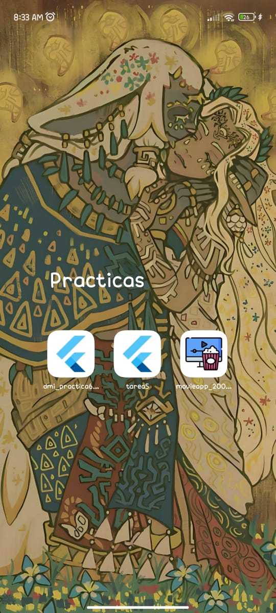
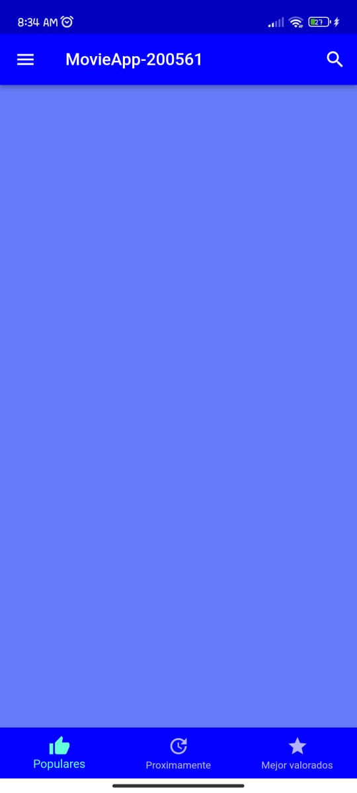
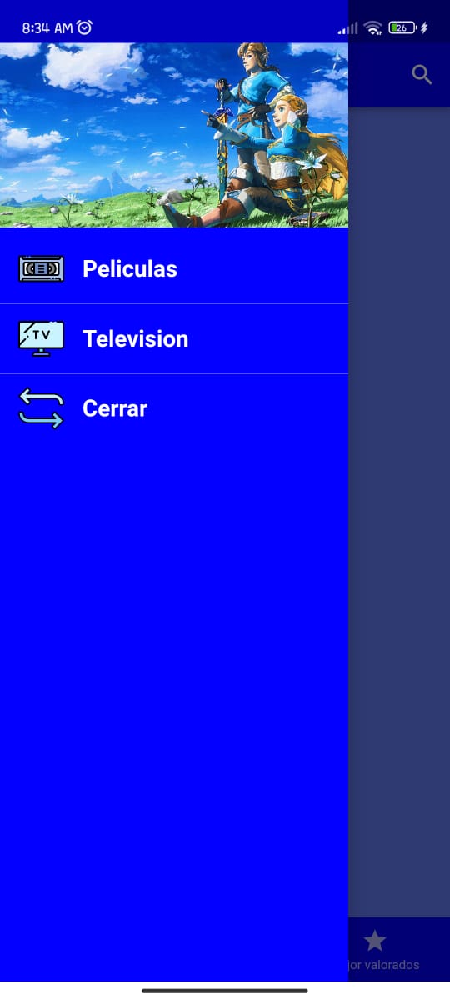
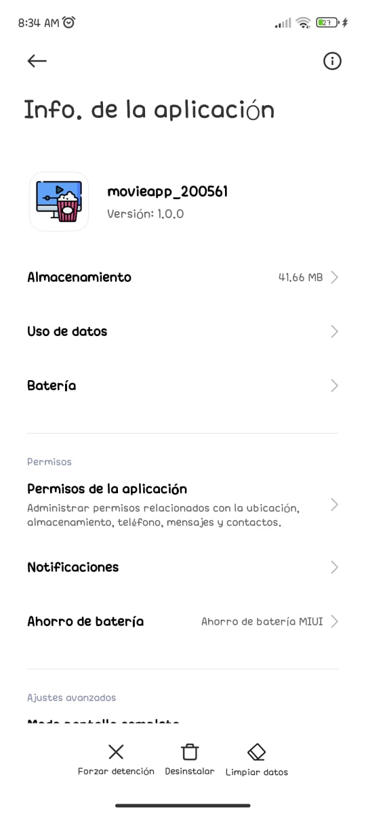

# DMI_Practica7_200561

  
# Universidad Tecnológica de Xicotepec de Juárez

## Ingeniería en Desarrollo y Gestión de Software
## Elisama Arturo Calva Moreno
## 10A
### Desarrollo Móvil Integral

## Capturas de Pantalla

  
  
  
  

&nbsp;
&nbsp;

|  Característica |  Información |
| :------------: | :------------: |
| Nombre  |  Practica 7 Aplicación en Flutter y StatelesWidgets |
| Descripción  | Esta aplicación fue creada con Flutter con la finalidad de poder mostrar un ejemplo sencillo de cambio de fuente y iconos en una aplicación en el cual se tiene que presentar un Drawer y un bottomNavigationBar. En base a estas características que tiene que llevar la aplicación, se tubo que hacer un cambio de fuentes de preferencia de Google Fonts ya que este es un servicio de distribución de fuentes tipográficas propiedad de Google. Incluye una amplia biblioteca de fuentes de código abierto, un directorio web interactivo para navegar por la biblioteca y una API para usar las fuentes a través de CSS​ y Android., y también  hacerle un cambio de iconos de nuestra preferencia. |
|  Fecha de Carga | 25/09/23  |

&nbsp;
&nbsp;

&nbsp;
&nbsp;

 
 
 
 

&nbsp;
&nbsp;
